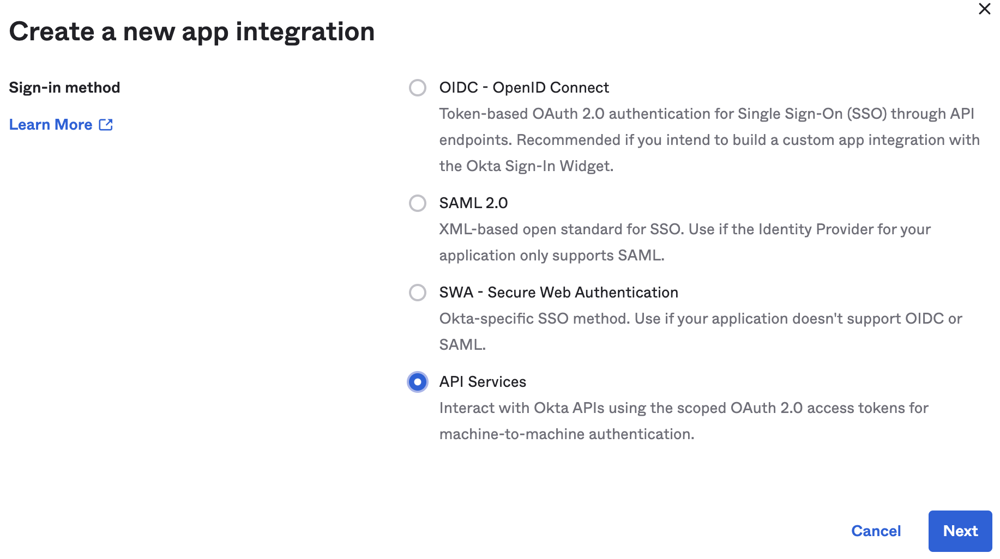
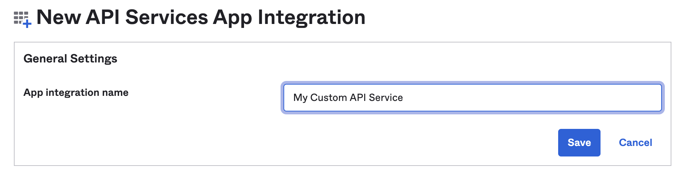
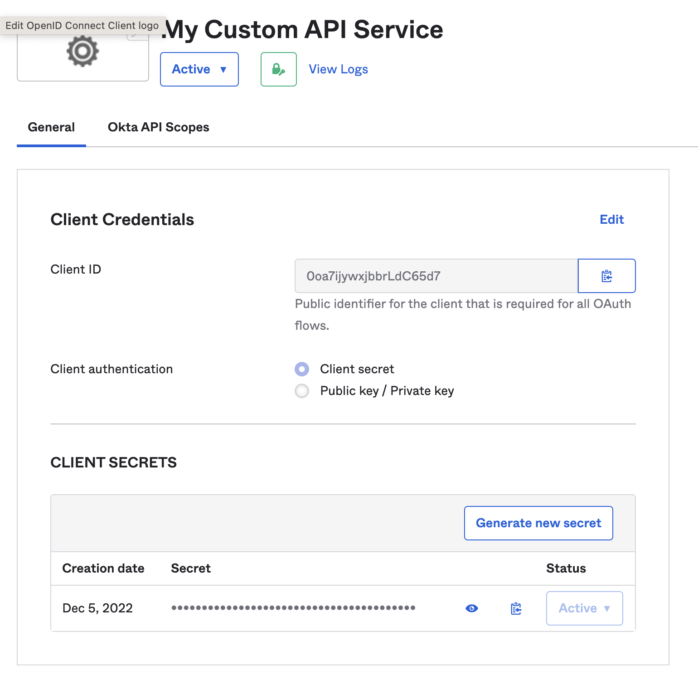
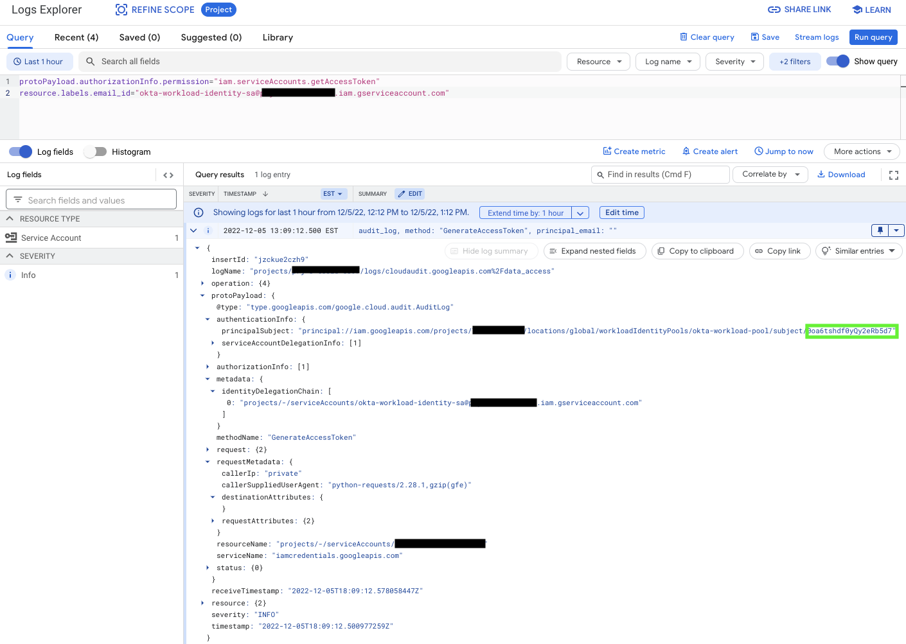
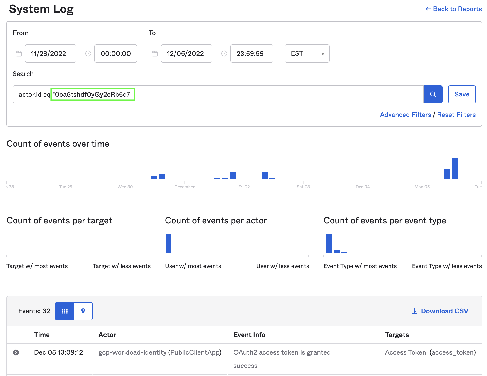

# Okta Workload Identity Federation

This is the Okta portion of a multi project set of examples for configuring Google Cloud Workload Identity Federation. Shout out to Prashant Kulkarni and his amazing [Medium post](https://medium.com/google-cloud/google-cloud-workload-identity-federation-with-okta-90c05b985b17) which led me in the right direction.

## Google Disclaimer
This is not an officially supported Google product

## Table of Contents
1. [Prerequisites](https://github.com/dreardon/workload-identity-okta#prerequisites)
1. [Google Service Account and Identity Pool](https://github.com/dreardon/workload-identity-okta#create-a-google-service-account-and-identity-pool)
1. [Okta API Authorization Server](https://github.com/dreardon/workload-identity-okta#create-an-okta-api-authorization-server)
1. [Connect Identity Pool to Okta](https://github.com/dreardon/workload-identity-okta#connect-identity-pool-to-okta)
1. [Create an Okta Application](https://github.com/dreardon/workload-identity-okta#create-an-okta-application)
1. [Validate Workload Identity Pool](https://github.com/dreardon/workload-identity-okta#validating-workload-identity-pool-setup)
1. [Auditing and Traceability](https://github.com/dreardon/workload-identity-okta#auditing-and-traceability)

## Prerequisites
<ul type="square"><li>An existing Google Project, you'll need to reference PROJECT_ID later in this setup</li>
<li>Enabled services</li>

```
gcloud services enable iamcredentials.googleapis.com
gcloud services enable vision.googleapis.com
```
</ul>

## Create a Google Service Account and Identity Pool
```
export PROJECT_ID=[Google Project ID]
export PROJECT_NUMBER=[Google Project Number]
export SERVICE_ACCOUNT=[Google Service Account Name] #New Service Account for Workload Identity
export WORKLOAD_IDENTITY_POOL=[Workload Identity Pool] #New Workload Identity Pool Name

gcloud config set project $PROJECT_ID

gcloud iam service-accounts create $SERVICE_ACCOUNT \
    --display-name="Okta Workload Identity SA"

gcloud projects add-iam-policy-binding $PROJECT_ID \
    --member="serviceAccount:$SERVICE_ACCOUNT@$PROJECT_ID.iam.gserviceaccount.com" \
    --role="roles/storage.admin"

gcloud projects add-iam-policy-binding $PROJECT_ID \
    --member="serviceAccount:$SERVICE_ACCOUNT@$PROJECT_ID.iam.gserviceaccount.com" \
    --role="roles/visionai.admin"

gcloud iam workload-identity-pools create $WORKLOAD_IDENTITY_POOL \
    --location="global" \
--description="Workload Identity Pool for Okta" \
--display-name="Okta Workload Pool"

gcloud iam service-accounts add-iam-policy-binding $SERVICE_ACCOUNT@$PROJECT_ID.iam.gserviceaccount.com \
    --role="roles/iam.workloadIdentityUser" \
    --member="principalSet://iam.googleapis.com/projects/$PROJECT_NUMBER/locations/global/workloadIdentityPools/$WORKLOAD_IDENTITY_POOL/*"
```

## Create an Okta API Authorization Server

An authorization server defines your Okta security boundary, and is used to mint access and identity tokens for use with OIDC clients and OAuth 2.0 service accounts when accessing your resources via API. Within each authorization server you can define your own OAuth scopes, claims, and access policies. This step is optional as the default api://default Authorization Server in Okta could be used instead.
TODO: Verify necessity of adding default Scope
| Instructions        | Screenshot          |
|:------------- |:-------------|
|<ul type="square"><li>In the Okta Administrator console, go to Security > API and click "Add Authorization Server" <li> Keep track of the "Audience" value you set as you will need it later when configuring Google <li> Keep track of the "Issuer" value that is provided as you will need it later when configuring Google </ul>| <br> | 


## Connect Identity Pool to Okta
After completing these steps, there will be a generated client-config.json file which will be used by the example code to covert the temporary Okta credentials to short-lived Google credentials.
```
export PROJECT_ID=[Google Project ID]
export PROJECT_NUMBER=[Google Project Number]
export SERVICE_ACCOUNT=[Google Service Account Name]
export WORKLOAD_IDENTITY_POOL=[Workload Identity Pool]
export WORKLOAD_PROVIDER=[Workload Identity Provider] #New Workload Provider Name
export AUDIENCE=[Audience URL] #From Okta Audience Configuration (e.g. api://default or your custom value)
export ISSUER=[ISSUER] #From Okta Issuer Configuration, also needed in the .env file

gcloud iam workload-identity-pools providers create-oidc $WORKLOAD_PROVIDER \
    --location="global" \
    --workload-identity-pool=$WORKLOAD_IDENTITY_POOL \
    --attribute-mapping="google.subject=assertion.sub" \
    --issuer-uri=$ISSUER \
    --allowed-audiences=$AUDIENCE

gcloud iam workload-identity-pools create-cred-config \
    projects/$PROJECT_NUMBER/locations/global/workloadIdentityPools/$WORKLOAD_IDENTITY_POOL/providers/$WORKLOAD_PROVIDER \
    --service-account="$SERVICE_ACCOUNT@$PROJECT_ID.iam.gserviceaccount.com" \
    --output-file=client-config.json \
    --credential-source-file="okta-token.json" \
    --credential-source-type="json" \
    --credential-source-field-name="access_token"
```

## Create an Okta Application

| Instructions        | Screenshot          |
|:------------- |:-------------|
|<ul type="square"><li>In the Okta Administrator console, go to Applications > Applications and click "Create App Integration" <li>For the purpose of the example code, select "API Services" <li>Give your application an identifiable name <li>Copy the ClientID and Secret and ensure they are in your local .env file </ul>| <br><br>  | 
    
## Validate Workload Identity Pool Setup
### NOTE: Make sure a valid "okta-token.json" is available
```
OKTA_JWT=$(cat ./okta-token.json | python3 -c "import sys, json; print(json.load(sys.stdin)['access_token'])")

curl -X POST https://sts.googleapis.com/v1/token -d "audience=//iam.googleapis.com/projects/$PROJECT_NUMBER/locations/global/workloadIdentityPools/$WORKLOAD_IDENTITY_POOL/providers/$WORKLOAD_PROVIDER&grant_type=urn:ietf:params:oauth:grant-type:token-exchange&requested_token_type=urn:ietf:params:oauth:token-type:access_token&subject_token_type=urn:ietf:params:oauth:token-type:id_token&subject_token=$OKTA_JWT&scope=https://www.googleapis.com/auth/devstorage.read_only"
```

## Auditing and Traceability
| Instructions        | Screenshot          |
|:------------- |:-------------|
|<ul type="square"><li>To search for Workload Identity Federation activity, the query on the right, with the service account created for short termed Google Cloud credentials will show the Okta subject</li><li>The subject shown in green can be used to find the associated log entry in Okta's logs </ul>|<br>  | 

### For More Detail
* https://medium.com/google-cloud/google-cloud-workload-identity-federation-with-okta-90c05b985b17
* https://github.com/patilkapil/workload-identity-okta
* https://cloud.google.com/sdk/gcloud/reference/iam/workload-identity-pools/create-cred-config
