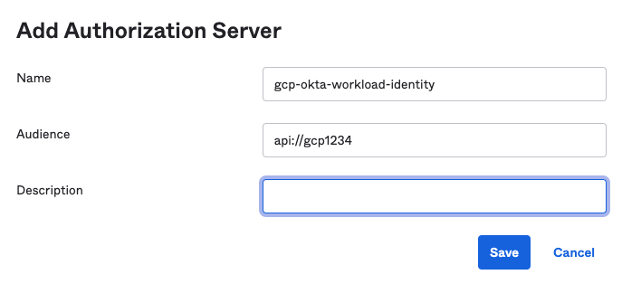
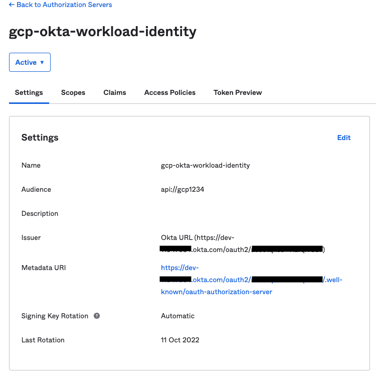

# Okta Workload Identity Federation

## Google Disclaimer
This is not an officially supported Google product

## Create a Google Service Account and Identity Pool
```
export PROJECT_ID=[Google Project ID]
export PROJECT_NUMBER=[Google Project Number]
export SERVICE_ACCOUNT=[Google Service Account Name]
export WORKLOAD_IDENTITY_POOL=[Workload Identity Pool]

gcloud iam service-accounts create $SERVICE_ACCOUNT \
    --display-name="Okta Workload Identity SA"

gcloud projects add-iam-policy-binding $PROJECT_ID \
    --member="serviceAccount:$SERVICE_ACCOUNT@$PROJECT_ID.iam.gserviceaccount.com" \
    --role="roles/storage.admin"

gcloud projects add-iam-policy-binding $PROJECT_ID \
    --member="serviceAccount:$SERVICE_ACCOUNT@$PROJECT_ID.iam.gserviceaccount.com" \
    --role="roles/visionai.admin"

gcloud iam workload-identity-pools create $WORKLOAD_IDENTITY_POOL \
    --location="global" \
--description="Workload Identity Pool for Okta" \
--display-name="Okta Workload Pool"

gcloud iam service-accounts add-iam-policy-binding $SERVICE_ACCOUNT@$PROJECT_ID.iam.gserviceaccount.com \
    --role="roles/iam.workloadIdentityUser" \
    --member="principalSet://iam.googleapis.com/projects/&PROJECT_NUMBER/locations/global/workloadIdentityPools/$WORKLOAD_IDENTITY_POOL/*"
```

## Create an Okta API Authorization Server


An authorization server defines your Okta security boundary, and is used to mint access and identity tokens for use with OIDC clients and OAuth 2.0 service accounts when accessing your resources via API. Within each authorization server you can define your own OAuth scopes, claims, and access policies.
| Instructions        | Screenshot          |
|:------------- |:-------------|
|<ul type="square"><li>In the Okta Administrator console, go to Security > API and click "Add Authorization Server" <li> Keep track of the "Audience" value you set as you will need it later when configuring Google <li> Keep track of the "Issuer" value that is provided as you will need it later when configuring Google </ul>| <br> | 


## Connect Identity Pool to Okta
```
export PROJECT_ID=[Google Project ID]
export PROJECT_NUMBER=[Google Project Number]
export SERVICE_ACCOUNT=[Google Service Account Name]
export WORKLOAD_IDENTITY_POOL=[Workload Identity Pool]
export WORKLOAD_PROVIDER=[Workload Identity Provider]
export AUDIENCE=[Audience URL] #From Okta Audience Configuration
export ISSUER=[ISSUER] #From Okta Issuer Configuration

gcloud iam workload-identity-pools providers create-oidc $WORKLOAD_PROVIDER \
    --location="global" \
    --workload-identity-pool=$WORKLOAD_IDENTITY_POOL \
    --attribute-mapping="google.subject=assertion.sub" \
    --issuer-uri=$ISSUER \
    --allowed-audiences=$AUDIENCE

gcloud iam workload-identity-pools create-cred-config \
    projects/$PROJECT_NUMBER/locations/global/workloadIdentityPools/$WORKLOAD_IDENTITY_POOL/providers/$WORKLOAD_PROVIDER \
    --service-account="$SERVICE_ACCOUNT@$PROJECT_ID.iam.gserviceaccount.com" \
    --output-file=okta-workload-identity.json \
    --credential-source-file="okta-token.json" \
    --credential-source-type="json" \
    --credential-source-field-name="access_token"
```

## Create an Okta Application
    TODO: Add Steps/Screenshots
    https://[your_okta_admin_url].okta.com/admin/apps/active
    Obtain Client ID and Secret ID and use them in your .env file
    
## Validating Workload Identity Pool Setup
### NOTE: Make sure a valid "okta-token.json" is available
```
OKTA_JWT=$(cat ./okta-token.json | python3 -c "import sys, json; print(json.load(sys.stdin)['access_token'])")

curl -X POST https://sts.googleapis.com/v1/token -d "audience=//iam.googleapis.com/projects/$PROJECT_NUMBER/locations/global/workloadIdentityPools/$WORKLOAD_IDENTITY_POOL/providers/$WORKLOAD_PROVIDER&grant_type=urn:ietf:params:oauth:grant-type:token-exchange&requested_token_type=urn:ietf:params:oauth:token-type:access_token&subject_token_type=urn:ietf:params:oauth:token-type:id_token&subject_token=$OKTA_JWT&scope=https://www.googleapis.com/auth/devstorage.read_only"
```

### For More Detail
* https://medium.com/google-cloud/google-cloud-workload-identity-federation-with-okta-90c05b985b17
* https://github.com/patilkapil/workload-identity-okta
* https://cloud.google.com/sdk/gcloud/reference/iam/workload-identity-pools/create-cred-config
